# 🌌 Multi-Service Kubernetes Ingress Architecture

<div align="center">


**A High-Performance, Path-Based Routing Infrastructure for Microservices**

[Overview](#-architecture-blueprints) • [Key Features](#-power-features) • [Deployment](#-rocket-launch-guide) • [Troubleshooting](#-pro-troubleshooting)

</div>

---

## 🏗️ Architecture Blueprints

This project demonstrates a real-world scenario where services are isolated in different namespaces but unified under a single Ingress gateway with intelligent path rewriting.

### 🛰️ Interactive System Flow

```mermaid
graph TD
    %% Define Nodes
    Browser["🌐 Web Browser"]
    Ingress["🛡️ NGINX Ingress Controller"]
    
    subgraph "Public Namespace (k8s-app1-namespace)"
        Service1["📦 App-1 Service (Port 3000)"]
        Proxy["🔗 Service-Proxy (ExternalName)"]
        Pod1["🚀 Pods: Nginx Website 1"]
    end
    
    subgraph "Private Namespace (k8s-app2-namespace)"
        Service2["📦 App-2 Service (Port 6000)"]
        Pod2["🚀 Pods: Nginx Website 2"]
    end

    %% Define Connections
    Browser -- "http://.../app1/" --> Ingress
    Browser -- "http://.../app2/" --> Ingress
    
    Ingress -- "Rewrite path to /" --> Service1
    Service1 --> Pod1
    
    Ingress -- "Forward to ExternalName" --> Proxy
    Proxy -. "Cross-NS DNS lookup" .-> Service2
    Service2 --> Pod2

    %% Styling
    style Ingress fill:#f96,stroke:#333,stroke-width:2px
    style Proxy fill:#00d,color:#fff,stroke-dasharray: 5 5
```



---

## 🔥 Power Features

| Feature | Description | Implementation |
| :--- | :--- | :--- |
| **Path Rewriting** | Handles sub-path assets (CSS/JS) automatically. | `rewrite-target: /$2` |
| **Cross-NS Routing** | Bridges different namespaces seamlessly. | `ExternalName` Services |
| **Regex Support** | Intelligent URL matching for complex routes. | `use-regex: "true"` |
| **Traffic Isolation** | Secure logical separation of concerns. | Kubernetes Namespaces |

---

## 🚀 Rocket Launch Guide

### 1️⃣ Prepare the Ground
Create the logical isolation layers first:
```bash
kubectl apply -f k8s-app1-namespace.yaml
kubectl apply -f k8s-app2-namespace.yaml
```

### 2️⃣ Deploy the Fleet
Spin up the application containers:
```bash
kubectl apply -f k8s-app1.yaml
kubectl apply -f k8s-app2.yaml
```

### 3️⃣ Configure the Radar
Set up the routing logic and Ingress controller rules:
```bash
kubectl apply -f server-proxy.yaml
kubectl apply -f ingress.yaml
```

---

## 🔬 Technical Deep Dive

### The "404 Styles" Challenge 🛡️
When serving an app on `/app1`, the browser thinks the base is `/`. If the app asks for `/css/main.css`, it hits the Ingress at `domain.com/css/main.css` (which doesn't exist).

**The Solution:**
We use a **Capture Group** regex:
```yaml
path: /app1(/|$)(.*)
```
1. `(/|$)` matches a slash OR the end of the string.
2. `(.*)` captures **everything** after that into `$2`.
3. `rewrite-target: /$2` ensures the pod sees the original sub-path.

---

## 🛠️ Pro Troubleshooting

| Issue | Potential Cause | Fix |
| :--- | :--- | :--- |
| **White page / No CSS** | Missing trailing slash | Ensure URL ends in `/` or use `nginx-ingress` configuration for auto-slash. |
| **502 Bad Gateway** | Selector Mismatch | Verification: `kubectl get ep -n k8s-app1-namespace` |
| **404 Not Found** | Ingress Controller | Ensure `ingressClassName: nginx` matches your controller's class. |

---

## 👨‍💻 Connect with the Dev
**Sayed Atwh** - *DevOps & Cloud Architect*

<div align="center">

[](https://sayedatwh.github.io/)
[](https://github.com/SayedAtwh)

</div>

---
*Built for scale. Documented for clarity.*